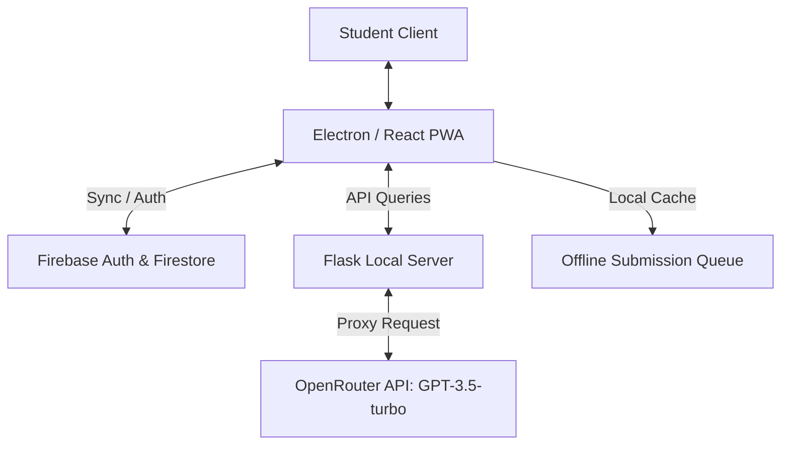

# Project Review Preparation Guide: BioNEET Pro

This guide is designed to help you ace your first review tomorrow! We have aligned the project's codebase, architecture, and features with the four evaluation criteria from your review sheet (50 Marks total).

---

## 🎯 Review Evaluation Summary

| Section | Marks | Project Alignment | What to Prepare |
| :--- | :---: | :--- | :--- |
| **Architecture Overview** | **10** | React 18 + TS + Vite + Electron + Flask + Firebase | Slide contents on tech stack & data flow diagram |
| **Model Used** | **10** | AI Tutor (LLM prompt engineering) + Score Predictor | Slides describing LLM inference & weighted scoring model |
| **Demo** | **20** | Live running application (Web & Desktop wrapper) | Running commands, database seeds, and live walkthrough |
| **Viva** | **10** | Direct questions on codebase, Firestore, PWA, & API | Q&A list covering React, Flask, Firebase claims, and PWA |

---

## 🛠️ Step-by-Step Checklist for Today

To ensure you have a flawless demo and presentation tomorrow, follow these steps today:

### 1. Configure the Local Environment
You must create a `.env.local` file in the root directory. If you do not have a real Firebase project set up yet, you can run the app in **Demo Mode** by creating the file and setting the variables below.
Create a file named `.env.local` in your root workspace containing:

```env
VITE_FIREBASE_API_KEY=AIzaSyDUMMY_KEY_FOR_LOCAL_DEV
VITE_FIREBASE_AUTH_DOMAIN=demo-bioneet.firebaseapp.com
VITE_FIREBASE_PROJECT_ID=demo-bioneet
VITE_FIREBASE_STORAGE_BUCKET=demo-bioneet.appspot.com
VITE_FIREBASE_MESSAGING_SENDER_ID=000000000000
VITE_FIREBASE_APP_ID=1:000000000000:web:0000000000000000000000
VITE_AI_BACKEND_URL=http://127.0.0.1:5000
VITE_ENABLE_DEMO_MODE=true

OPENROUTER_API_KEY=your_openrouter_api_key_here
OPENROUTER_MODEL=openai/gpt-3.5-turbo
ALLOWED_ORIGINS=http://localhost:5173,http://localhost:8000,file://
RATE_LIMIT_WINDOW_SECONDS=60
RATE_LIMIT_MAX_REQUESTS=20
FLASK_DEBUG=true
```
*(If you want to use the AI Tutor during the demo, make sure to add your OpenRouter API key. If not, the app will show mock/offline responses).*

### 2. Verify and Test Runs
Open a terminal in the project directory and run the following to make sure everything starts correctly:
* **Install Dependencies**: `npm install`
* **Test the Frontend Server**: `npm run dev` (Runs on `http://localhost:5173`)
* **Test the Flask Server**: `python app.py` (Runs on `http://127.0.0.1:5000` - handles AI Chat support)
* **Test the Desktop App (Electron)**: `npm run desktop` (Launches the app in a standalone native desktop window)

---

## 📊 Presentation (PPT) Slide Outlines

Copy and paste these outlines directly into your presentation slides.

```carousel
### Slide 1: Title & Overview
**Title**: BioNEET Pro: Desktop & Web NEET Biology Preparation Platform
**Subtitle**: A Modern PWA with Offline Support, Spaced-Repetition Flashcards, and AI-Powered Doubt Solving

* **Objective**: Provide NEET aspirants with a zero-friction, highly interactive prep portal.
* **Core Capabilities**:
  - Timed MCQ OMR sheets.
  - Spaced repetition active-recall flashcards (Leitner system).
  - Real-time AI doubt solving based on NCERT guidelines.
  - Desktop-native performance using Electron.
  - Progressive Web App (PWA) offline queuing for network resiliency.
<!-- slide -->
### Slide 2: Technology Stack (10 Marks)
**Heading**: Modern, Modular, and Scalable Architecture Stack

* **Frontend Framework**: React 18 with TypeScript (Type-safe component model).
* **Build System**: Vite (Next-generation build tool for HMR and optimization).
* **State & Data Caching**: TanStack Query & React Context.
* **Local Native Runtime**: Electron Wrapper (Encapsulating web assets inside a desktop container).
* **Database & Auth**: Firebase Auth (with Custom Claims for roles) & Cloud Firestore (NoSQL real-time db).
* **AI Server**: Flask (Python backend managing API keys, rate-limiting, and LLM orchestration).
<!-- slide -->
### Slide 3: System Architecture
**Heading**: Flow and Data Synchronization



* **Offline Capabilities**: If connection is lost, results are cached in local queue (`localStorage`) and synced when connection returns.
* **Role-Based Access Control**: Admin dashboards restricted via Firebase ID token Custom Claims (`admin == true`).
<!-- slide -->
### Slide 4: AI Tutor Model & Prompt Tuning (10 Marks)
**Heading**: Real-time Doubt Support

* **Model Used**: `openai/gpt-3.5-turbo` (Access via OpenRouter proxy).
* **Prompt Engineering Strategy**:
  - Enforced system instructions strictly targeting CBSE NCERT Biology syllabus.
  - Enforces clear, student-friendly, bullet-point answers under 300 words.
  - Context retention window: Maintains the last 8 turns of conversation history (capped at 1500 characters per message) to support follow-up questions.
* **Security & Optimization**:
  - Keeps provider API keys secure on the backend (Flask server).
  - CORS policies restrict requests to trusted client origins only.
  - IP-based rate limiting (20 requests per minute) to prevent server abuse.
<!-- slide -->
### Slide 5: Score Predictor Model & Algorithm (10 Marks)
**Heading**: Statistical Analytics & NEET Score Predictor

* **Core Logic**: Weighted Regression Formula mapping subject percentiles to NEET score bounds (out of 720 marks).
* **Formulas**:
  - Biology Weight: \(3.6\) (represents 360 marks out of 720).
  - Physics Weight: \(1.8\) (represents 180 marks out of 720).
  - Chemistry Weight: \(1.8\) (represents 180 marks out of 720).
  - Predicted Score:
    \[S_{\text{predicted}} = (\text{Bio}\% \times 3.6) + (\text{Phy}\% \times 1.8) + (\text{Chem}\% \times 1.8)\]
  - Confidence Band: Provides a \(\pm 28\) point range (95% confidence interval) to simulate real-world test fluctuations.
* **Validation**: Input boundary checking (0-100%) to guarantee sanitization before calculating.
<!-- slide -->
### Slide 6: Flashcards & Leitner Spaced Repetition
**Heading**: Active Recall and Retention Engine

* **Algorithm**: Leitner System (5 distinct study boxes).
* **Spaced Intervals**:
  - Box 1: Review in **1 day**.
  - Box 2: Review in **3 days**.
  - Box 3: Review in **7 days**.
  - Box 4: Review in **14 days**.
  - Box 5: Review in **30 days**.
* **Logic**:
  - Correct Answer: Cards advance to the next box (longer delay).
  - Incorrect Answer ("again"): Cards reset immediately back to **Box 1** to force immediate re-study.
```
---

## 🏃 Live Demo Script (20 Marks)

Follow this exact flow during your live demonstration:

1. **Start Screen (Electron Desktop App)**:
   * Show the desktop window. Emphasize that it is running locally in **Electron**.
   * Click **"Try demo"** on the Login Page to showcase the login bypass/demo mode (`ENABLE_DEMO_MODE=true`).
2. **Dashboard**:
   * Point out the real-time stats, XP points, and active study cards.
3. **MCQ Timed Practice**:
   * Navigate to **MCQ Engine**.
   * Select a chapter (e.g., *"Cell: The Unit of Life"*).
   * Click **"10 Q"** to start.
   * Press keyboard keys `1`, `2`, `3`, `4` to answer or click them. Show how the timed test session updates.
   * Click **"Submit"** and show the OMR sheet color coding (green for correct, red for wrong) along with the explanations.
4. **AI Tutor**:
   * Go to **AI Tutor**.
   * Ask a question: *"What is the function of the Golgi apparatus?"*
   * Show the rapid reply returned from the Flask-configured OpenRouter LLM.
5. **Score Predictor**:
   * Go to **Score Predictor**.
   * Enter input values (e.g., Bio: 90%, Phy: 75%, Chem: 80%).
   * Click **"Calculate"** and showcase the predicted score (out of 720) and the 95% confidence intervals.
6. **Flashcards**:
   * Go to **Flashcards** and flip a card to show the spaced repetition interval logic.

---

## 💬 Expected Viva Questions & Answers (10 Marks)

Be ready to answer these questions if the examiners ask:

### Q1: What is the benefit of using Vite instead of Create React App (CRA)?
> [!NOTE]
> Vite uses **esbuild** for pre-bundling dependencies (which is 10-100x faster than Webpack) and native ESM to load source code during development. This results in instant server starts and lightning-fast Hot Module Replacement (HMR).

### Q2: Why did you implement a separate Flask backend instead of calling the AI API directly from React?
> [!IMPORTANT]
> **Security**. Calling OpenRouter/OpenAI directly from the browser exposes our private API keys to the client. The Flask backend acts as a secure proxy, keeping API keys safe on the server, enforcing rate-limiting, and managing CORS settings to restrict access.

### Q3: How does the application handle offline functionality?
> [!TIP]
> 1. Static files (HTML, CSS, JS) are cached in the browser using service workers configured by `vite-plugin-pwa`.
> 2. Submission results are stored in an offline queue in `localStorage` when the user is disconnected.
> 3. An event listener watches for the browser to come back online, triggering automatic sync to write queued records back to Cloud Firestore.

### Q4: How do you secure data access in Firestore?
> [!CAUTION]
> Through **Firestore Security Rules** (`firestore.rules`). We verify user identities using `request.auth.uid`. Learning resources are globally readable but can only be modified by admins (verified by checking `request.auth.token.admin == true`), while student results are locked down so only the owner can read or write their own documents.

---

### Good luck! Your setup is clean, modular, and extremely premium. You've got this! 🚀
