# 🧬 BioNEETPro V2 — Data Model & Schema Specification

## 1. Overview of Collections

BioNEETPro V2 persists its data models using Google Cloud Firestore (backed by atomic JSON file storage in local and offline modes):

| Collection | Description | Access Rights |
| :--- | :--- | :--- |
| `users` | User accounts, authentication metadata, and role mappings | Admin: RW, Teacher: R, Student: R (own) |
| `teachers` | Institutional faculty records and metadata | Admin: RW, Teacher: R (own profile) |
| `assessments` | Scheduled and draft tests, time windows, and question snapshots | Teacher/Admin: RW, Student: R (sanitized) |
| `assessment_results` | Student submissions, scorecards, and concept evaluations | Teacher/Admin: R (all), Student: R/W (own) |
| `pending_mcqs` | AI-generated questions awaiting teacher review | Teacher/Admin: RW, Student: None |
| `learner_profiles` | BKT latent concept mastery and historical learning trajectories | Student: R/W, System: RW |

---

## 2. Document Schemas

### 2.1 `teachers` Collection
**Document ID**: `teacher_<uuid>` or Firebase UID (e.g., `teacher_a8f1b2c3d4e5`)

```json
{
  "id": "teacher_a8f1b2c3d4e5",
  "uid": "teacher_a8f1b2c3d4e5",
  "name": "Prof. Anjali Sharma",
  "email": "sharma@bioneet.edu",
  "role": "TEACHER",
  "department": "Botany",
  "subjects": ["Class 11 Biology", "Plant Physiology"],
  "phone": "+91-9876543210",
  "status": "ACTIVE",
  "createdAt": "2026-09-06T12:00:00.000Z",
  "updatedAt": "2026-09-06T12:00:00.000Z",
  "createdBy": "admin_super_user"
}
```

- `status`: `"ACTIVE"` or `"INACTIVE"`. Toggling to `"INACTIVE"` disables login and invalidates session tokens.
- `role`: Canonical role string `"TEACHER"`.

---

### 2.2 `assessments` Collection
**Document ID**: `asmt_<uuid>` (e.g., `asmt_4c8e19b0d231`)

```json
{
  "id": "asmt_4c8e19b0d231",
  "assessmentId": "asmt_4c8e19b0d231",
  "title": "Class 11 Cell Biology Weekly Test",
  "type": "WEEKLY_TEST",
  "subject": "Biology",
  "class_id": "class_11",
  "classLevel": "class_11",
  "chapter_id": "c08",
  "chapterId": "c08",
  "chapter_name": "Cell: The Unit of Life",
  "chapterName": "Cell: The Unit of Life",
  "createdBy": "teacher_a8f1b2c3d4e5",
  "teacherName": "Prof. Anjali Sharma",
  "status": "PUBLISHED",
  "start_at": "2026-09-06T14:00:00.000Z",
  "startAt": "2026-09-06T14:00:00.000Z",
  "end_at": "2026-09-06T15:00:00.000Z",
  "endAt": "2026-09-06T15:00:00.000Z",
  "duration_minutes": 45,
  "durationMinutes": 45,
  "total_marks": 80,
  "totalMarks": 80,
  "passing_marks": 32,
  "passingMarks": 32,
  "negative_marking": true,
  "negativeMarking": true,
  "question_ids": ["q1", "q2"],
  "questionIds": ["q1", "q2"],
  "questions": [
    {
      "id": "q1",
      "question": "Which organelle is known as the powerhouse of the cell?",
      "options": ["Ribosome", "Mitochondria", "Golgi apparatus", "Lysosome"],
      "correct_index": 1,
      "correct_answer": "Mitochondria",
      "chapter": "Cell: The Unit of Life",
      "topic": "Mitochondria",
      "concept_id": "BIO-C08-MITO",
      "explanation": "Mitochondria generate ATP through aerobic cellular respiration."
    }
  ],
  "questionSnapshots": [ /* Identical snapshot array for immutability */ ],
  "createdAt": "2026-09-06T12:30:00.000Z",
  "updatedAt": "2026-09-06T12:35:00.000Z"
}
```

- **Answer Stripping**: For `role: "STUDENT"`, the fields `correct_index`, `correct_answer`, and `explanation` are completely scrubbed from all question objects until the test transitions to `RESULTS_AVAILABLE`.
- **Dual Naming Compatibility**: The document maintains both snake_case and camelCase attributes to ensure 100% interoperability with frontend JavaScript and backend Python services.

---

### 2.3 `assessment_results` Collection
**Document ID**: `res_<asmt_id>_<student_id>` (guarantees single submission lock)

```json
{
  "id": "res_asmt_4c8e19b0d231_student_v2_test",
  "resultId": "res_asmt_4c8e19b0d231_student_v2_test",
  "assessmentId": "asmt_4c8e19b0d231",
  "assessment_id": "asmt_4c8e19b0d231",
  "assessmentTitle": "Class 11 Cell Biology Weekly Test",
  "studentId": "student_v2_test",
  "student_id": "student_v2_test",
  "studentEmail": "student@school.edu",
  "studentName": "Aarav Patel",
  "score": 3,
  "totalMarks": 8,
  "total_marks": 8,
  "percentage": 37.5,
  "correct": 1,
  "correct_count": 1,
  "incorrect": 1,
  "incorrect_count": 1,
  "unattempted": 0,
  "unattempted_count": 0,
  "totalQuestions": 2,
  "total_questions": 2,
  "timeSpentSeconds": 120,
  "time_spent_seconds": 120,
  "questionResponses": [
    {
      "questionIndex": 0,
      "question": "Which organelle is known as the powerhouse of the cell?",
      "chosen": 1,
      "correct": 1,
      "outcome": "correct",
      "chapter": "Cell: The Unit of Life"
    },
    {
      "questionIndex": 1,
      "question": "The 70S ribosomes are found in:",
      "chosen": 1,
      "correct": 0,
      "outcome": "incorrect",
      "chapter": "Cell: The Unit of Life"
    }
  ],
  "conceptPerformance": {
    "BIO-C08-MITO": { "correct": 1, "total": 1, "chapter": "Cell: The Unit of Life" },
    "BIO-C08-RIBO": { "correct": 0, "total": 1, "chapter": "Cell: The Unit of Life" }
  },
  "submittedAt": "2026-09-06T14:25:00.000Z"
}
```

---

### 2.4 `pending_mcqs` Collection
**Document ID**: `gen_mcq_<timestamp>_<index>`

```json
{
  "id": "gen_mcq_1725619200_0",
  "question": "Which structure connects thylakoids of adjacent grana in a chloroplast?",
  "options": ["Stroma lamellae", "Cristae", "Tonoplast", "Mesosome"],
  "correct_index": 0,
  "correct_answer": "Stroma lamellae",
  "chapter": "Cell: The Unit of Life",
  "topic": "Chloroplasts",
  "difficulty": "medium",
  "explanation": "Stroma lamellae are membranous tubules connecting the thylakoids of different grana.",
  "is_ai_generated": true,
  "status": "APPROVED",
  "approved_by": "teacher_a8f1b2c3d4e5",
  "approved_at": "2026-09-06T13:00:00.000Z"
}
```

---

### 2.5 `learner_profiles` Collection
**Document ID**: `<student_id>` (e.g., `student_v2_test`)

```json
{
  "student_id": "student_v2_test",
  "overall_mastery": 0.68,
  "trajectory_stage": "Competent",
  "trajectory_advice": "Good working understanding. Consolidate biochemical pathways and numerical ratios.",
  "concept_mastery": {
    "BIO-C08-MITO": {
      "mastery": 0.74,
      "attempts": 4,
      "correct": 3,
      "incorrect": 1,
      "last_attempt": "2026-09-06T14:25:00.000Z",
      "topic_id": "Cell: The Unit of Life",
      "chapter_id": "c08"
    }
  },
  "last_active": "2026-09-06T14:25:00.000Z"
}
```

---

## 3. Entity Relationship Diagram

```mermaid
erDiagram
    SUPER_ADMIN ||--o{ TEACHER : provisions
    TEACHER ||--o{ ASSESSMENT : authors
    TEACHER ||--o{ PENDING_MCQ : reviews_and_approves
    ASSESSMENT ||--o{ ASSESSMENT_RESULT : collects
    STUDENT ||--o{ ASSESSMENT_RESULT : submits
    STUDENT ||--|| LEARNER_PROFILE : owns
    ASSESSMENT_RESULT ||--o{ LEARNER_PROFILE : updates_bkt
```


